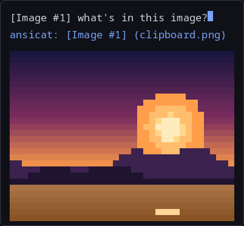

# pi-ansicat

An extension for [pi](https://pi.dev), the coding agent ([source](https://github.com/earendil-works/pi)).

[](https://www.npmjs.com/package/pi-ansicat)
[](./LICENSE)

Paste an image into pi and see it. pi-ansicat reads the clipboard, draws a
truecolor ANSI preview under your message, and attaches the image to the
prompt. It also keeps text-only models in the loop: before submit, a vision
model describes the image and the description rides along as text, so a model
that cannot see images still knows what you pasted.

## What it does

- **Paste with `Ctrl+V`.** An `[Image #N]` marker lands in the editor, a
  half-block preview renders below it, and the image attaches on submit.
- **Preview anywhere.** The preview is plain ANSI text, so it survives foot,
  tmux, ssh, and any terminal that shows truecolor. No image protocol needed.
- **No dependencies for PNG and BMP.** Decoding is built in.
- **Vision fallback for text-only models.** If your current model cannot take
  images, each pasted image is described once and the text is appended to the
  prompt.

## Demo

Paste with `Ctrl+V` — the `[Image #N]` marker lands in the editor and a
truecolor preview renders right below it. This is the real renderer output
(`renderHalfBlocks`, default 14 lines), drawn as a terminal mock:



## Install

```bash
pi install npm:pi-ansicat
```

Then `/reload` in pi. On first start, pi-ansicat asks to unbind pi's built-in
image paste from `Ctrl+V` (the same keys, otherwise you get a double paste).
The original `keybindings.json` gets a backup next to it
(`keybindings.json.bak-ansicat-<timestamp>`). Answer
yes once, or edit it yourself:

```json
{ "app.clipboard.pasteImage": [] }
```

## Requirements

Linux only. Wayland needs `wl-clipboard`, X11 needs `xclip`.

Preview works out of the box for PNG (any bit depth or color type, including
palette — interlaced/Adam7 PNGs are the exception: they attach but don't
preview) and BMP. JPEG, WebP, and GIF are previewed when one of ImageMagick
(`magick` or `convert`) or `ffmpeg` is installed. Without a converter, those
three still attach to the message, just without a preview.

## Use

Paste with `Ctrl+V` (`Alt+V` and `Ctrl+Alt+V` work too). The preview appears
below your message as a local preview block — a session annotation the model
never sees; the `[Image #N]` marker in the editor is what actually attaches
the image on submit. Delete the marker and the image is not sent.

One command handles previews and sizing:

```text
/ansicat /path/to/image.png   # preview an image file (@path and ~/... also work)
/ansicat cols=32 maxLines=8   # resize the preview (applies live, this session only)
/ansicat                      # show the current size
```

File previews share the clipboard's 20MB cap, and formats outside
PNG/BMP/JPEG/WebP/GIF report the format as unsupported.

## Why the vision fallback

A text-only model (most fast/cheap models) receives an image attachment and
cannot read it. Pi strips the image, and the model never learns what you
pasted.

The fallback runs only for those models. Before submit, pi-ansicat sends each
attached image to a vision model you configure, appends the returned
description to your prompt, and labels it as machine-generated evidence —
data the model can reason from, never instructions to follow. Models that
already accept images skip the fallback entirely and get the real image.

## Config

Optional `~/.pi/agent/ansicat.json` — the path follows `$PI_CODING_AGENT_DIR`
when set (default `~/.pi/agent`); the old `~/.pi/ansicat.json` is still read.
Both keys are optional, defaults shown:

```json
{
  "cols": 48,
  "maxLines": 14
}
```

Values clamp to those ranges (`cols` 20–120, `maxLines` 4–40).

The vision fallback needs to know which model to use. Add a `vision` block so
text-only models still get a description:

```json
{
  "cols": 48,
  "maxLines": 14,
  "vision": { "provider": "openai", "model": "gpt-4o-mini" }
}
```

`provider` and `model` name any vision-capable model already configured in pi
(see `pi --list-models`); the values above are only an example. Optional
`prompt` replaces the built-in describe prompt; `maxTokens` caps the
description length. The `vision`
block is used only when the active model cannot take images. Without it,
text-only models get a warning and the image is dropped.

## How it works

1. Reads the clipboard with `wl-paste` or `xclip` (auto-detected).
2. Decodes PNG and BMP with no extra dependencies and renders a half-block
   truecolor preview (a session-local entry — the preview never enters the
   model's context). PNG support covers every bit depth (1/2/4/8/16), color
   types 0/2/3/4/6 (gray, RGB, palette, gray-alpha, RGBA), and `tRNS`
   transparency; BMP covers 1/4/8-bit palette and 24/32-bit.
3. Converts JPEG, WebP, and GIF to PNG first, using a system image tool when
   one is present. No converter means no preview, never a wrong one.
4. On submit at a text-only model, describes each image once and appends the
   description as labeled machine-generated evidence. Descriptions are cached
   per session so the same image is not described twice.

## Privacy

Images processed by the vision fallback are downscaled locally first (through
pi's own image resizer) and sent only to the provider named in `ansicat.json`
— that provider is reached through pi, so credentials stay in pi's own auth
store and never pass through this package. Preview blocks are session-local
annotations and never enter the model's context. Clipboard reads, decoding,
and previews are all local; nothing is logged, cached to disk, or sent
anywhere else.

## Troubleshooting

- **Nothing happens on `Ctrl+V`.** Another program owns the key, or pi's
  built-in paste is still bound. Check the keybindings step in Install, then
  `/reload`.
- **"No image found in clipboard."** The clipboard has no image, or
  `wl-clipboard`/`xclip` is missing. Test with `wl-paste --list-types` or
  `xclip -selection clipboard -t TARGETS -o`.
- **Preview is blank or missing.** The format has no converter installed. See
  Requirements. The image still attaches.
- **"text-only model and no vision config."** Add a `vision` block to
  `~/.pi/agent/ansicat.json`.

## License

MIT
